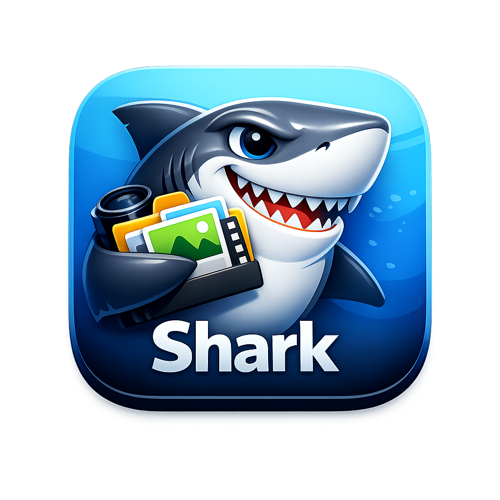

  

# Shark

**[中文](../README.md)** | **English**

An open-source asset manager built for speed.

Shark is a local-first alternative to [Eagle](https://eagle.cool/), designed for designers, illustrators, and anyone who works with large collections of images. No cloud, no accounts, no subscriptions — just your files, organized your way.

## Features

- **Lightning-fast grid** — Virtual scrolling that stays smooth at 100k+ items
- **Instant search** — Full-text search across filenames, tags, and notes (< 200ms)
- **Two-tier thumbnails** — 256px for browsing, 1024px on demand; no lag
- **Smart folders** — Save filter combinations as live folders
- **Tag & rate** — Organize with tags, ratings, and notes
- **Deduplication** — SHA256 content-based duplicate detection on import
- **Color extraction** — Auto-dominant color extraction using K-means in Lab space
- **Local & private** — Everything stays on your machine. SQLite + filesystem, nothing leaves your disk

## Tech Stack

| Layer | Technology |
|-------|-----------|
| Frontend | React 18, TypeScript, Zustand, Tailwind CSS |
| Backend | Tauri v2 (Rust) |
| Database | SQLite (WAL mode) with FTS5 |
| Virtual Scroll | @tanstack/react-virtual |
| Image Processing | Rust `image` crate |

## Supported Formats (MVP)

JPG, PNG, GIF, WebP, BMP

*Post-MVP: SVG, PSD, AI, Sketch, TIFF, video, fonts*

## Roadmap

- **Phase 1** — Core viewer: library management, folder import, thumbnail generation, virtual grid, image viewer
- **Phase 2** — Organization: tags, folder tree, drag & drop import, search, color extraction, rating, batch operations
- **Phase 3** — Polish: smart folders, dedup dialog, error handling, performance tuning, packaging & auto-update

## Development

*Project is in early development. Build instructions will be added once scaffolding is complete.*

Prerequisites: Node.js, Rust toolchain, Tauri CLI

## License

MIT

## Sponsor

If you find Shark useful, consider buying me a coffee — with enough support I can register as an Apple Developer and ship notarized macOS builds through the App Store.

*(Sponsor links coming soon)*
